<p align="center">
  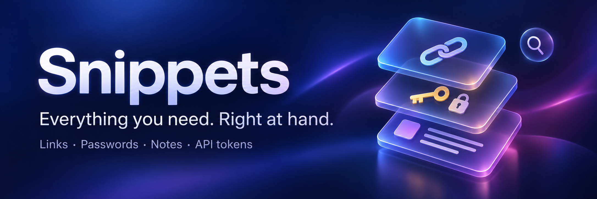
</p>

# Snippets

**Your personal library of links, passwords, API tokens, notes, and everyday information — ready for you and your agents.**

Save something once, give it a memorable keyword, and find it when you need it.
Insert a link into a conversation without switching apps. Keep a password or API token
in an authenticated vault. Work with your library side by side on iPad. Keep an iPhone companion in your pocket. Let an agent look up
saved information through the CLI, with your approval required before a secret is revealed.

Built around the Mac, with a keyboard-oriented iPad workspace and an iPhone companion,
Snippets works locally without an account. The native Apple apps share optional
end-to-end encrypted iCloud sync. A native Android client and an alternative
sync service are also implemented in this repository; see their [current status](#android-and-snippets-cloud).

<p align="center">
  <a href="#get-started"></a>
  <a href="#ipad-workspace-and-iphone-companion"></a>
  <a href="#android-and-snippets-cloud"></a>
  <a href="LICENSE"></a>
</p>

<p align="center">
  <a href="https://github.com/wowlocal/snippets/releases"><strong>Download for Mac</strong></a> ·
  <a href="#get-started">Get started</a> ·
  <a href="#a-look-inside">Screenshots</a> ·
  <a href="#for-agents-and-automation">CLI for agents</a> ·
  <a href="#building-and-contributing">Build from source</a>
</p>

## Keep the things you keep looking up

| What you save | What Snippets does for you |
|---|---|
| Meeting links, dashboards, shared documents, useful URLs | Find by name or tag; type a keyword such as `\meet` to insert the saved link on Mac. |
| Passwords, API tokens, private credentials, sensitive notes | Mark the entry **Secure** to encrypt its body and require device-owner authentication to use it. |
| Addresses, contact details, account information, instructions | Keep a searchable reference library; pin the entries you reach for most. |
| Replies, signatures, checklists, recurring messages | Reuse the full text, with dates, times, and clipboard placeholders filled in when copied or inserted. |
| Information an agent needs to do a task | Let it search and read ordinary entries through `snippets-cli`, or request a specific secret for human approval. |
| Text or links you copied earlier | Retrieve them from optional, encrypted clipboard history on Mac, or turn an entry into a permanent snippet. |

An entry can be a single URL, a password, or several paragraphs. Names, keywords, tags,
and pins organize the library. **Sensitive information belongs in the body of an entry
marked Secure**; ordinary entries and secure metadata remain readable in local storage.

## A look inside

### The Mac is where it all comes together

<p align="center">
  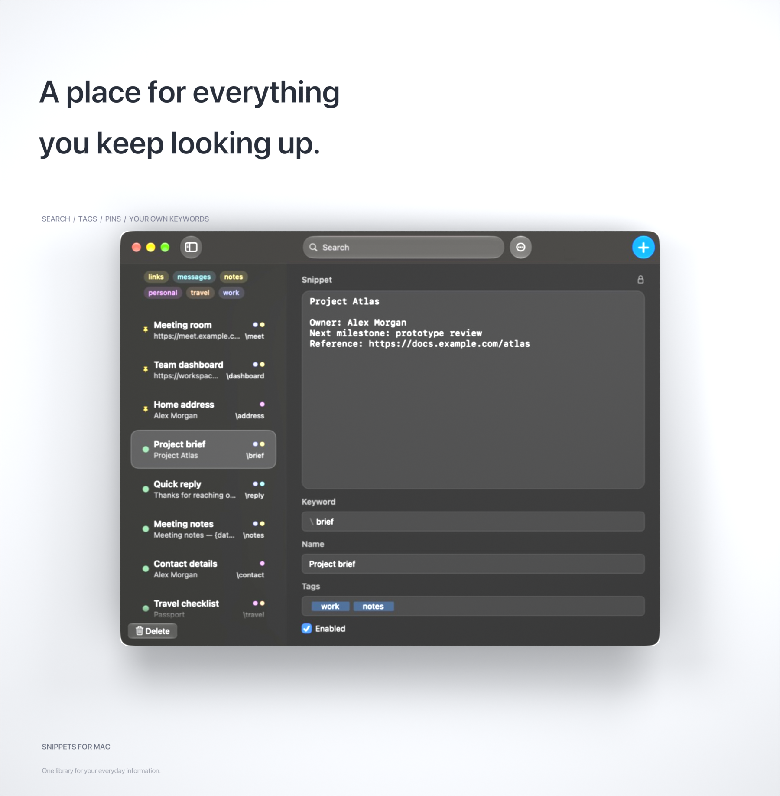
  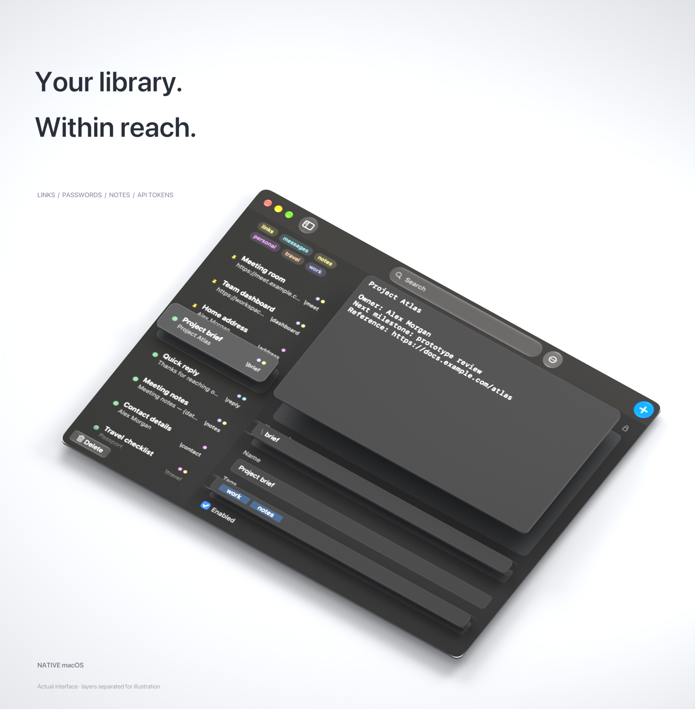
</p>

Find a saved link, keep a private credential close, or reuse a whole message. A native
AppKit workspace brings the library, editor, tags, pins, and keywords together.
Type a keyword in another app to insert what you saved; open the global picker when
you want to search first. Your agents can reach the same library through the CLI.

*Actual Mac UI with fictional demonstration content. The perspective artwork separates
UI layers for illustration. [Artwork source and rendering instructions](docs/artwork/README.md).*

### A proper workspace on iPad

<p align="center">
  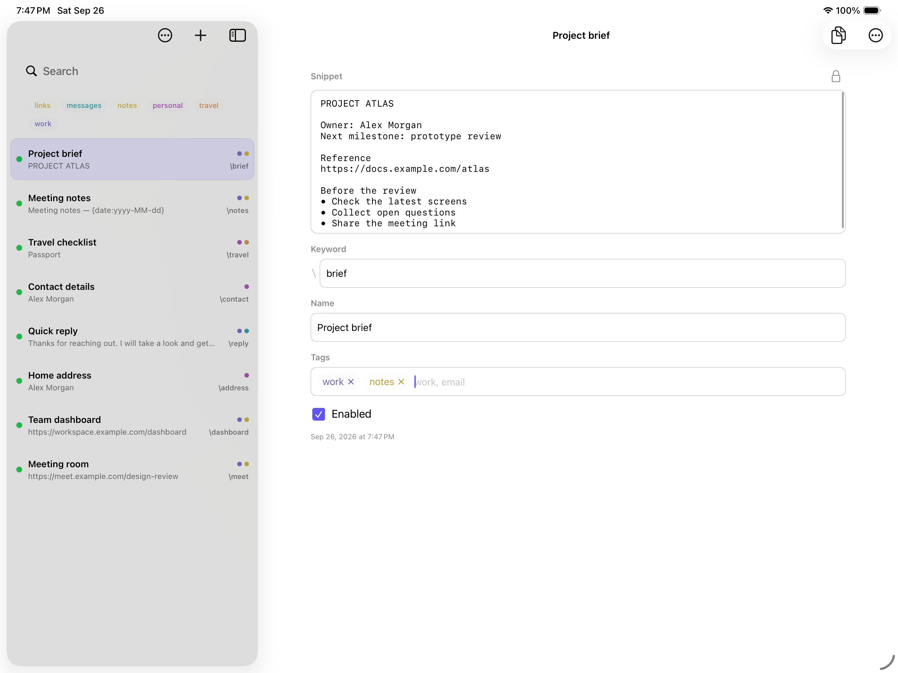
</p>

The iPad app gives your library room to work: a split view, a full editor, hardware
keyboard commands, and secure entries. The iPhone companion keeps quick lookup,
authenticated copy, and small edits available when you are away from your desk.

## At a glance

| Capability | Mac | iPad / iPhone | Android source preview |
|---|---|---|---|
| Local library, editing, search, tags, and pins | Yes | Yes | Yes |
| Use information in another app | Global expansion and paste picker | Copy and system sharing | Copy, sharing, and **Insert Snippet** text action |
| Secure bodies with authenticated access | Vault, protected editor, Secure Paste | Vault, protected editor, expiring secure copy | Secure records preserved, opening them not yet supported |
| Date, time, and clipboard placeholders | Yes | Yes, resolved on copy | Not yet |
| Encrypted iCloud sync | Opt-in | Opt-in | Not available |
| Encrypted clipboard history | Opt-in | — | — |
| JSON / Raycast import and encrypted library backups | Yes | Yes | Not yet |
| CLI for scripts and agents | Bundled | — | — |
| Snippets Cloud sync | Internal opt-in build | Internal opt-in build | Internal opt-in build |

The detailed library, vault, transfer, and placeholder features below describe the
Apple apps unless a platform is named explicitly. Android's implemented scope and
remaining work are [documented separately](docs/android/IMPLEMENTATION.md).

## Get started

1. Download a Mac build from [GitHub Releases](https://github.com/wowlocal/snippets/releases),
   or [build the app for your platform](#building-and-contributing).
2. Create an entry, paste in a useful link, and set its keyword to `meet`.
3. On Mac, enable Snippets in **System Settings → Privacy & Security → Accessibility**
   using the app's permission banner, then click **Refresh**. Type `\meet` in a supported
   text field to insert the link. On iPad, select and copy an entry; on iPhone, tap its row to copy it.
4. For a password or API token, enable **Secure** in the editor. On Mac, use `⌘\`
   to choose and authenticate a secure insertion. On iPhone or iPad, authenticate to copy.
5. Optionally enable iCloud sync on each Apple device. Install the Mac CLI from
   **Settings → Integrations → Command Line Tool** to make the library available to agents.

Accessibility permission is needed for cross-app insertion on Mac; library management
works without it. Some macOS configurations also require Input Monitoring. The Mac app
starts with an example entry. iPhone and iPad start empty, ready for your own entries,
an import, or your existing cloud library.

## Find and organize your information

- **Search beyond the title.** The Apple library searches names, keywords, ordinary
  content, and tags. Names, keywords, and tags support fuzzy subsequences: `prjal`
  can find **Project Alpha**. Body search uses contiguous text matching.
- **Combine tags.** Select several tags to find entries matching all of them. Tag
  matching ignores case and diacritics; tag counts help you explore the library.
- **Keep essentials close.** Pin frequently used entries, and enable or disable a
  keyword without deleting the saved information.
- **Capture from where you work.** Create an entry from the clipboard. On Mac, the
  system **Services** menu can also turn selected text into a new snippet.
- **Edit with help.** Get keyword suggestions from the name or first line, warnings
  about duplicate or conflicting triggers, and previews of resolved placeholders.
- **Manage the whole library.** Create, edit, duplicate ordinary entries, delete,
  import, and export. Undo and redo ordinary library changes; iPhone also offers an
  inline Undo after deleting an ordinary entry.
- **Search settings too.** Find sync, vault, backup, diagnostics, and integration
  controls through a dedicated settings search.

Secure entries remain discoverable through their name, keyword, and tags while locked.
Their bodies never enter library search, even while a secure editor is unlocked.

## A shortcut away on Mac

### Insert without switching apps

<p align="center">
  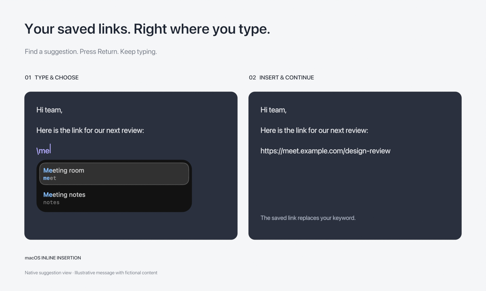
</p>

*The native suggestion view in an illustrative message; all content is fictional.*

Type `\` followed by a keyword to bring up suggestions next to the caret. An
unambiguous exact match expands automatically. For other matches, use `↑` / `↓`,
`Ctrl+N` / `Ctrl+P`, `Tab`, or `Return` to choose.

The suggestion panel supports fuzzy name and keyword matching, matched-letter
highlighting, pinned entries, optional usage-based ranking, and memory of what you
usually select for a prefix. That learning stays on this Mac and can be reset in Settings.

Ordinary insertion uses Accessibility replacement where supported. Clipboard-based
fallbacks restore the previous clipboard without overwriting something you copied in
the meantime. Browser compatibility includes Chrome, Chromium, Edge, Brave, Opera,
Vivaldi, and Arc; additional Chromium/Electron apps can be configured by bundle ID.
Automatic expansion pauses during Secure Keyboard Entry.

### Search and paste with one global shortcut

Press **`⌘\`** to open the library picker from another app. Search, then press Return
or `⌘1` through `⌘9` to select a result. With a supported field focused, Snippets
returns to that original field to insert the entry. Without one, it can copy an ordinary
entry and show a confirmation. Secure entries require an insertion destination and
authentication; the Mac picker does not copy their bodies to the clipboard.

Press **`⌥⌘\`** to show or hide the main library. The Mac app also offers a menu bar
item, launch at login, configurable quit-or-hide behavior, a collapsible sidebar,
keyboard-driven search overlay, and Sparkle updates in supported release builds.
Settings lets you adjust global shortcuts, match highlighting, usage ranking,
selection memory, and browser compatibility without rebuilding the app.

## Passwords, tokens, and private notes

Turn on **Secure** for an entry to move its body from the ordinary JSON library into
an AES-GCM encrypted vault. Use it for passwords, API tokens, credentials, or any
text you want to disclose deliberately.

| Protection | Behavior |
|---|---|
| Authenticated access | Reveal or edit through a device-owner-authenticated vault session. Secure Paste, iOS secure copy, and CLI reveal use one-use authentication. |
| Searchable while locked | Names, keywords, and tags remain visible locally; the encrypted body stays hidden. |
| Deliberate use | Secure entries never auto-expand and are excluded from ordinary exports, share links, and duplication. |
| Automatic locking | Five minutes without secure-content use, with a thirty-minute maximum session. Mac sleep, screen/session lock, screensaver start, and iOS backgrounding lock the vault immediately. |
| Recovery | An optional recovery key can restore the vault key if it is lost from Keychain. A password-protected full backup can include secure records. |

**Settings → Secure Snippets** shows vault and key-storage status, lets you lock the
vault immediately, and provides recovery-key setup and restoration.

**On Mac**, Secure Paste inserts into supported text and password fields without placing
the secure body on the clipboard. The destination is captured and revalidated before
insertion. Secure editor text uses capture-protected rendering and becomes visible only
while the pointer is over the active editor. Ambient copy, drag, Services, sharing,
Find, speech, Quick Look, text checking, and Writing Tools disclosure routes are disabled.

**On iPhone and iPad**, explicit secure copy authenticates on every use, stays local to
the device, and expires after **60 seconds**. Protected editors hide the body during
screen capture or when protected rendering is unavailable. Secure body text is excluded
from the accessibility tree, including after visual reveal; ordinary text and metadata
retain normal accessibility. This deliberately limits VoiceOver access to secure bodies.

<details>
<summary>Secure Paste compatibility and protection boundaries</summary>

Password fields use supported Accessibility replacement; capable browser fields use
range replacement with bounded readback. Other supported surfaces use a single
Unicode-bearing keyboard event addressed to the captured process. That direct-input
fallback rejects control characters such as Return, newline, and Tab, makes no retry,
and reports delivery as unconfirmed because macOS supplies no acknowledgement.
Multiline support therefore depends on the target and insertion route.

Secure Event Input can suppress third-party global shortcuts in password fields. The
frontmost app's Services menu provides **Secure Paste** and **Open Snippets** fallbacks.
Switching away from Snippets on Mac does not itself lock the vault, because secure
insertion happens while another app is active.

Protected rendering reduces accidental capture and shoulder-surfing exposure. It
cannot stop a physical camera or privileged software from observing disclosed content.
After insertion, copy, or an approved CLI reveal, the receiving app or process has the
plaintext. See the [input compatibility guide](docs/text-input-detection.md),
[capture verification guide](docs/secure-capture-manual-verification.md), and
[iOS accessibility boundary](docs/ios-secure-accessibility-protection.md).

</details>

## For agents and automation

**Your agent can use the same library you use.** The bundled Mac `snippets-cli` lets
scripts and agents find saved links, retrieve reference information, maintain ordinary
entries, and ask for a specific secret. Install it from **Settings → Integrations →
Command Line Tool**.

```sh
# Find a saved dashboard or document.
snippets-cli search "dashboard"
snippets-cli list --tag work --tag links
snippets-cli get dashboard

# Save a useful URL for yourself and future agent sessions.
snippets-cli add --keyword dashboard --name "Team dashboard" \
  --content 'https://example.com/dashboard' --tags work,links --pinned

# Keep a reference entry up to date; content can also come from stdin.
snippets-cli update dashboard --add-tags daily
snippets-cli add --keyword handoff --name "Project handoff" \
  --content - --tags work < handoff.txt

# Discover secure entries by metadata, then request a secret you created in the app.
snippets-cli secure-status
snippets-cli search "Atlas API token"
snippets-cli reveal atlas-token
```

### The agent asks; you authorize the secret

For example, ask your agent:

> Request the secure entry `atlas-token` from my Snippets library using
> `snippets-cli reveal atlas-token`. Wait for my approval and authentication
> before continuing. Do not include the token in your response.

<p align="center">
  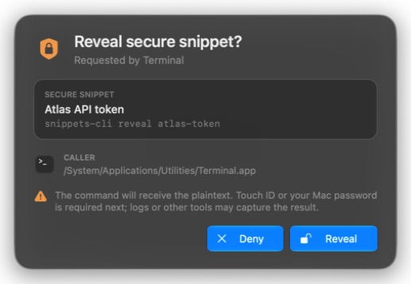
</p>

*The native macOS approval window, shown with fictional demo metadata.*

1. The agent finds a secure entry by its metadata or known keyword.
2. `snippets-cli reveal atlas-token` asks the running Mac app for access.
3. Snippets shows an approval window identifying the requesting program and invocation.
4. You approve and authenticate with Touch ID or your Mac password.
5. Only then does the command receive the secret as plaintext on standard output.

The CLI cannot decrypt the vault itself. `list` and `search` expose content-free secure
metadata; `get` refuses secure bodies and points to `reveal`. A denied request or a
closed app does not disclose the secret. Once approved, the calling agent or tool can
read the returned value, so its own output and transcript handling matter.

| Commands | Purpose |
|---|---|
| `list`, `search`, `get`, `tags` | Read ordinary entries, discover secure metadata, inspect tag usage. |
| `add`, `update`, `delete` | Manage ordinary entries by keyword or ID, including tags, pins, and enabled state. |
| `secure-status` | Check secure-entry count, app availability, and vault status. |
| `reveal` | Request a secure body through the app's human approval and authentication flow. |

Data commands return JSON; successful `reveal` deliberately returns the raw text.
Errors go to stderr with a nonzero exit code. Run `snippets-cli help` for all flags.
Create and edit secure entries in the app: CLI `add` creates an **ordinary** entry.

Ordinary library reads and writes work with the Mac app closed. With the app running,
file changes are merged into its library. When sync is enabled, CLI mutations share a
one-second trailing debounce before an outbound sync round; otherwise, they can sync
when the app next launches.

## Your library across Apple devices

Enable **iCloud sync** independently on each installation. Local use needs no sync
account, and with sync off the app does not create a CloudKit transport or sync base.

- **Encrypted before upload.** Names, keywords, tags, and bodies are encrypted on-device
  before reaching the private CloudKit database. The wire key is shared through iCloud
  Keychain; secure bodies retain their separate vault encryption.
- **Works through offline edits.** Changes are reconciled when devices reconnect.
  Field-aware three-way merging preserves independent edits. Concurrent body edits
  retain the other version as a disabled conflict copy.
- **Checks before destructive changes.** Suspiciously large remote deletion batches
  require review. A changed iCloud account, environment, or remote zone also stops sync
  for explicit recovery instead of silently mixing libraries.
- **Updates automatically.** Startup, foreground, CloudKit push events, and a six-hour
  missed-push health check trigger sync. Use **Sync Now** or pull to refresh on iPhone
  whenever you want to request a round.
- **Keeps device history separate.** Clipboard history, usage rankings, and learned
  prefix choices are not synced with the library.

Local persistence uses coordinated writes and merge protection for concurrent Mac app
and CLI changes. An unreadable library is quarantined for recovery rather than treated
as an empty library that should erase other devices. See [sync design and safety](docs/cloud-sync.md).

## Clipboard history on Mac

<p align="center">
  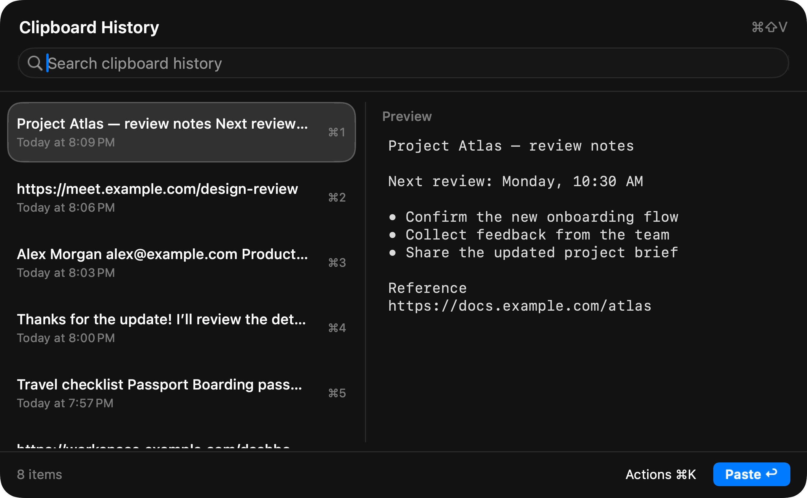
</p>

*The native history picker with fictional demo content: find a recent copy, preview
its full text, then paste it or turn it into a saved snippet.*

Enable **Settings → Clipboard History**, then press **`⌘⇧V`** to find text or links you
copied earlier. Recording is off by default; until enabled, it neither monitors the
clipboard nor registers that shortcut.

| In the history picker | Action |
|---|---|
| Type to search | Search copied text with a full, literal preview. |
| `Return` | Paste into the original supported field, or copy if no destination is available. Settings can make Copy the default. |
| `⌘Return` | Copy the selected entry. |
| `⌘1` … `⌘9` | Use one of the first nine results with the current primary action. |
| `⌘N` | Turn the selected item into a snippet draft. |
| `⌘Delete` | Delete an entry. |
| `⌘K` | Open the actions menu. |

History preserves whitespace and literal `{placeholder}` text. Pasting a history item
leaves it as the current clipboard. Temporary snippet insertions and clipboard restores
do not create history entries.

The history file is encrypted with a device-local key and excluded from sync, snippet
exports, and backups. It retains up to **7 days, 1,000 entries, and 32 MiB of text**
while enabled, with a **256 KiB** per-entry limit. Images and files are not captured.
You can exclude apps, stop recording while keeping existing history, or clear it even
when recording is off. Sensitive clipboard markers and default password-manager
exclusions reduce capture of secrets; unmarked secrets cannot be identified reliably.
See [clipboard history](docs/clipboard-history.md) for the full behavior.

## Reusable text with live placeholders

On Mac, iPhone, and iPad, dates, times, and clipboard contents are resolved when you
copy or insert an entry. For example, save this as a recurring handoff note:

```text
Update for {date:yyyy-MM-dd}

Reference: {clipboard}
Next check: {date format="EEEE, MMMM d" offset=+1d}
```

| Placeholder | Result |
|---|---|
| `{clipboard}` | Current clipboard text |
| `{date}` / `{time}` / `{datetime}` | Current date, time, or both, using localized formatting |
| `{date:yyyy-MM-dd}` | Date using a compact custom pattern |
| `{date format="EEEE, MMMM d"}` | Date using an explicit quoted pattern |
| `{date locale="fr-FR"}` | Localized date in a selected locale |
| `{date offset=+1d}` | Tomorrow's date |
| `{datetime offset="+1d -2h"}` | Date and time shifted by multiple terms |

Offset units are `m` (minutes), `h` (hours), `d` (days), `M` (months), and `y` (years).
Quote offsets containing multiple terms. Choose either `format` or `locale` for a
single placeholder; an offset can accompany either. Supported Raycast date syntax is
accepted or converted during import. Unknown or unsupported placeholders remain literal.

The Mac editor offers placeholder completion after `{`. Ordinary entries have a
rendered preview; secure bodies are kept out of ordinary preview surfaces.

<p align="center">
  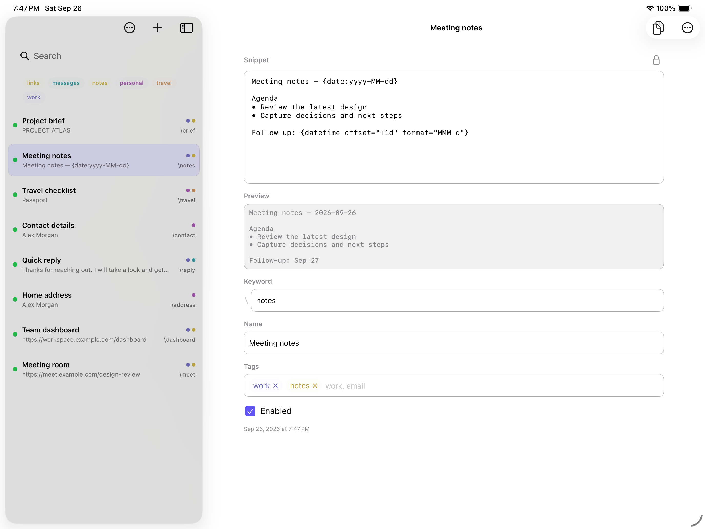
</p>

*On iPad, the editor shows the saved template and its resolved preview together.*

## iPad workspace and iPhone companion

**iPad is the larger workspace away from your Mac.** Keep the library and editor side
by side, collapse the sidebar, and use a hardware keyboard to search, select, copy,
create, edit, move between fields, import/export, and undo/redo. `⌘K` opens the shortcut
reference; hold Option to see the full list. Edit reusable text with a resolved
placeholder preview, or authenticate to work with a secure entry.

<details>
<summary>See the iPad keyboard shortcut reference</summary>

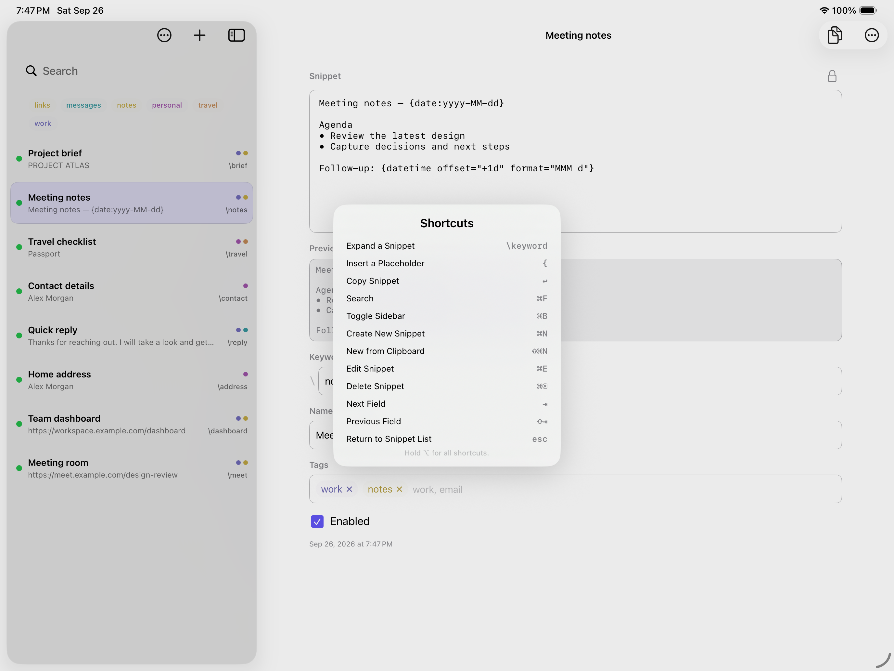

</details>

**iPhone is your pocket companion.** Tap a row to copy, swipe right to edit, swipe left
to pin or delete, and long-press for more actions. Search, multi-tag filters, and a
pinned section make quick retrieval easy. The editor separates **Content** and
**Details**, with a mode control that follows the keyboard, live keyword help, tags,
secure conversion, and an expandable placeholder preview.

Both use native UIKit, document import, system sharing for ordinary entries, encrypted
backups, and reviewed incoming links. Cross-app use on iPad and iPhone is explicit
copy and paste; system-wide `\keyword` expansion is a Mac feature.

<details>
<summary>See the iPhone companion</summary>

<p align="center">
  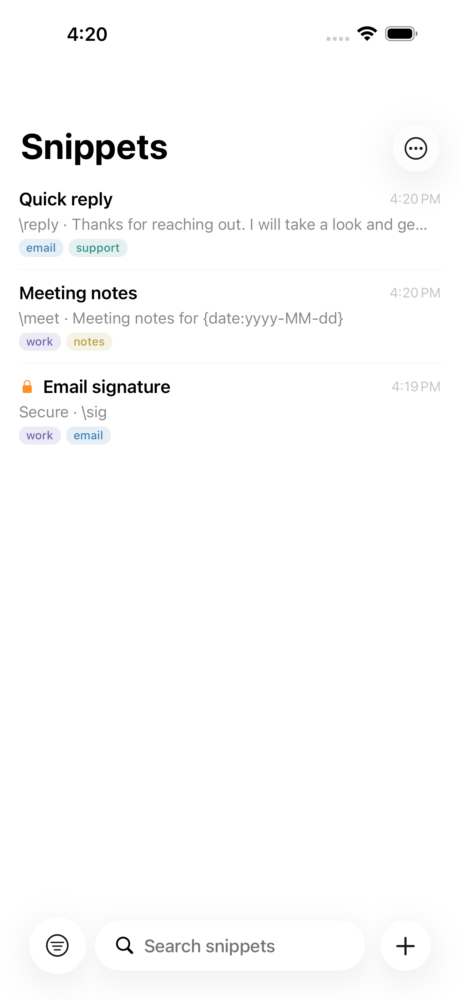
  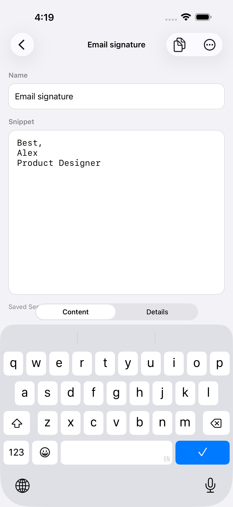
</p>

</details>

## Import, share, and take your data with you

| Format or action | What it includes |
|---|---|
| Native JSON import | Raw arrays (`[...]`) or wrapped libraries (`{"snippets": [...]}`). |
| Raycast import | Snippet exports and supported date placeholders, with a choice to keep or remove leading `!` keywords. |
| **Export for Sharing** | Ordinary entries only, as portable JSON. |
| **Encrypted Backup** | Password-protected full library, including secure records; restore through import. |
| `snippets://share?...` | A link carrying one ordinary entry, reviewed before import. |
| `snippets://new?...` | A hand-writable link for creating a new entry from another workflow. |

Native imports merge by ID first, then by case-insensitive keyword, so importing the
same records again updates them instead of multiplying rows. Shared links show a
preview and confirmation. iPhone and iPad keep incoming link entries disabled until
you review and enable them. Share links carry readable content, so secure entries
cannot be shared this way.

Creation links accept optional `name`, `keyword`, `content`, and comma-separated `tags`.
Percent-encode values when building them in Shortcuts, Alfred, scripts, or other tools:

```text
snippets://new?name=Team%20dashboard&keyword=dashboard&content=https%3A%2F%2Fexample.com%2Fdashboard&tags=work,links
```

A creation link adds a new entry after confirmation; it does not overwrite an existing
one by keyword. For secrets, use the app's Secure workflow rather than putting them in
a URL. Keep encrypted-backup passwords safe: they cannot be recovered.

## Privacy you can inspect

| Data | Storage and disclosure boundary |
|---|---|
| Ordinary Apple library | Readable local JSON; encrypted before cloud upload. |
| Secure entries | Encrypted bodies in the vault; names, keywords, and tags remain readable locally. |
| Mac clipboard history | Separately encrypted, device-local, excluded from library sync and backups. |
| Mac usage learning | Local ranking history; never synced or exported with snippets. |
| Shared JSON and links | Ordinary plaintext content, disclosed by an explicit export or share action. |
| Encrypted backups | Password-protected ordinary and secure library records. |
| Diagnostics | Bounded plaintext structured logs; bodies, names, tags, clipboard contents, IDs, paths, ciphertext, and keys are excluded. Sanitized secure keywords may be present. |

Mac and iOS settings can export one validated diagnostic JSONL file or delete retained
logs. Retention is bounded to **14 days, 64 files, and 24 MiB**, with rotation at 1 MiB
or 24 hours. See the [privacy policy](docs/privacy-policy.md) and
[diagnostics contract](docs/diagnostics.md).

<details>
<summary>Where the Apple apps keep their data</summary>

The Mac storage root is `~/Library/Application Support/SnippetsClone`. iOS uses
`Library/Application Support/SnippetsClone` inside its app container.

```text
SnippetsClone/
├── snippets.json          # ordinary entries
├── Vault/vault.json       # secure metadata and encrypted bodies
├── Sync/                  # checkpoints, journal, merge state, and tombstones
├── ClipboardHistory/      # encrypted Mac clipboard history
├── Usage/usage.json       # Mac-only usage learning
├── Diagnostics/Logs/      # bounded structured logs
└── Backups/               # local safety snapshots
```

</details>

## Keyboard shortcuts

### Mac global actions

| Shortcut | Action |
|---|---|
| `\keyword` | Expand an ordinary entry in a supported text field |
| `⌘\` | Search the paste picker; authenticate for secure entries |
| `⌥⌘\` | Show or hide Snippets |
| `⌘⇧V` | Open clipboard history when enabled |

<details>
<summary>Mac library and iPad keyboard reference</summary>

These shortcuts act in the appropriate library or editor context. The in-app panel
shows essentials first; hold Option for the full reference.

| Shortcut | Mac | iPad |
|---|---|---|
| `Return` | Copy selected ordinary entry | Copy selected entry; authenticate if secure |
| `⌘Return` | Paste into the previously active app | — |
| `⌘F` | Search | Search |
| `⌘B` | Toggle sidebar | Toggle sidebar |
| `⌘K` | Toggle shortcut panel | Toggle shortcut panel |
| `⌘N` / `⇧⌘N` | New / new from clipboard | New / new from clipboard |
| `⌘E` | Edit selected entry | Edit selected entry |
| `⌘D` | Duplicate ordinary entry | — |
| `⌘/` / `⌘.` | Enable-disable / pin-unpin | — |
| `⌘Delete` | Delete selected entry | Delete selected entry |
| `⇧⌘C` | Copy share link | — |
| `⇧⌘I` / `⇧⌘E` | Import / export for sharing | Import / export for sharing |
| `⌘Z` / `⇧⌘Z` | Undo / redo | Undo / redo |
| `Ctrl+N` / `Ctrl+P` | Next / previous entry | Next / previous entry |
| `Tab` / `Shift+Tab` | Move between controls | Next / previous editor field |

</details>

## Android and Snippets Cloud

**Implemented in source, with a deliberately limited default rollout.** Normal Apple
builds use the existing opt-in iCloud path. Android defaults to a local-only library.
Snippets Cloud account and sync controls require explicit internal build configuration;
the hosted service is not publicly launched.

The native Kotlin/Compose Android app supports phone and tablet layouts, a library
and editor, search, multi-tag filtering, pins, copying, and sharing. Android's
**Insert Snippet** text action can replace selected text in a compatible app or copy
when the selection is read-only. Its local store uses device-bound AES-256-GCM encryption
with Android Keystore protection and excludes app data from Android backup and transfer.

Android preserves encrypted secure records across sync but cannot yet open their
bodies. It has no system-wide keyword expansion, custom keyboard, or Accessibility
service. Background sync scheduling, broader device validation, and production delivery
work remain; see [implementation status](docs/android/IMPLEMENTATION.md).

The alternative **Snippets Cloud** implementation includes:

- Native email and six-digit-code sign-in on Apple and Android, with rotating sessions.
- Trusted-device pairing through a short-lived QR invitation and comparison code,
  plus an offline recovery kit. Signing in alone does not unlock an existing library.
- One active writable sync provider, with provider switching designed to retain local
  intent and the source cloud library.
- A self-hostable Go/PostgreSQL service that stores encrypted records and opaque
  pairing/recovery envelopes, with no snippet decryption keys or plaintext search.
- An open [HTTP protocol](api/snippets-sync-v2.yaml) and cross-platform compatibility tests.

Self-hosted builds pin their own service origin; a runtime Custom Server picker is not
currently a shipped feature. Start with the [Android overview](docs/android/README.md),
[implementation guide](docs/android/IMPLEMENTATION.md), and [server documentation](server/README.md).

## Building and contributing

| Target | Minimum OS | Native interface |
|---|---|---|
| Mac | macOS 15.5 | AppKit |
| iPhone and iPad | iOS / iPadOS 26.0 | UIKit, one universal app |
| Android source preview | Android 9 / API 28 | Kotlin and Compose |

Open `Snippets.xcodeproj` in Xcode, select **Snippets** or **Snippets iOS**, choose a
destination, and build. iOS requires an Xcode version with the iOS 26 SDK. The iOS
target is a native universal app, not Catalyst or a wrapper around the Mac app.
Android toolchain setup is covered in the [implementation guide](docs/android/IMPLEMENTATION.md).

For a paired iPhone or iPad, the install helper builds Release, validates the signed
artifact and provisioning profile, installs in place, and launches without removing data:

```sh
./scripts/install-ios.sh
```

Use `--device <name>` with multiple paired devices, `--no-build` to reuse the current
artifact, or `--no-launch` to install without opening. Production iCloud access depends
on the artifact's actual signed entitlements and matching provisioning profile, not
the configuration name. See [AGENTS.md](AGENTS.md) for signing and storage safeguards.

<details>
<summary>Remote iOS installation and release tooling</summary>

`./scripts/share-ios.sh` can expose a temporary, tokenized OTA installation link through
ngrok for registered devices. It defaults to two hours; `--ttl`, `--status`, `--stop`,
and `--reuse-ipa` control its lifecycle. The Mac and ngrok must remain online during
download, and the device must be authorized by the embedded provisioning profile.
Run the script with `--help` for the full options.

TestFlight and App Store workflows preserve validated archives, dSYMs, source receipts,
and release tags. See [iOS release automation](docs/ios-release.md). Building or testing
the project does not require publishing a release.

</details>

### Repository map

| Path | Responsibility |
|---|---|
| `snippets/` | Mac app, expansion, clipboard history, platform integrations |
| `snippets-ios/` | Native iPhone and iPad interfaces |
| `snippets/Core/`, `snippets/Sync/`, `snippets/Vault/`, `snippets/SnippetStore.swift` | Model, storage, crypto, merge, sync, and vault logic, with platform boundaries |
| `snippets-cli/` | Mac CLI and app-mediated secure reveal |
| `CorePackage/` | Foundation-only shared-core test overlay |
| `app/`, `AndroidCorePackage/` | Compose Android app and shared Swift/JNI core |
| `server/`, `api/` | Go sync service and HTTP protocol |
| `Tests/`, `snippets-ios-tests/`, `snippets-ios-uitests/`, `snippets-cross-platform-tests/` | Core, app, UI, and cross-platform checks |
| `scripts/`, `Distribution/` | Build, install, verification, diagnostics, and release tooling |

CloudKit remains at the Apple app boundary. The shared core does not unconditionally
import AppKit, UIKit, CloudKit, CocoaLumberjack, or MetricKit. Android compiles canonical
Swift domain sources through a narrow JNI bridge rather than maintaining a separate
translation of the encryption and merge rules.

### Verification

Run checks for the layer you change. For shared Apple code:

```sh
swift test --package-path CorePackage

xcodebuild \
  -project Snippets.xcodeproj -scheme Snippets -configuration Debug \
  -destination 'platform=macOS,arch=arm64' \
  -derivedDataPath /tmp/snippets-macos-derived \
  CODE_SIGNING_ALLOWED=NO build

xcodebuild \
  -project Snippets.xcodeproj -scheme 'Snippets iOS' -configuration Debug \
  -destination 'generic/platform=iOS Simulator' \
  -derivedDataPath /tmp/snippets-ios-derived \
  CODE_SIGNING_ALLOWED=NO build
```

Run iPhone and iPad unit/UI tests using available simulators as described in
[AGENTS.md](AGENTS.md). UI tests reset into temporary storage and disable sync.
Never use the live support directory for tests.

<details>
<summary>Android, server, integration, and performance checks</summary>

After the Android bootstrap and SDK setup:

```sh
swift test --package-path AndroidCorePackage

JAVA_HOME="/Applications/Android Studio.app/Contents/jbr/Contents/Home" \
  ./gradlew :app:testDebugUnitTest :app:connectedDebugAndroidTest

./scripts/test-cross-platform-sync.sh
ruby scripts/cross-platform-tls-edge-tests.rb
```

The cross-platform lane uses disposable macOS, iOS, Android, and PostgreSQL/HTTPS
fixtures to verify convergence, offline deletion, interrupted acknowledgements, and
scope isolation. It expects a sibling `../snippets-server` worktree by default;
override with `SNIPPETS_SERVER_WORKTREE`. See the
[test strategy](docs/test-strategy.md) for prerequisites and exact gates.

`./scripts/seed-android-demo.sh [adb-serial]` installs demonstration entries into a
chosen test device without changing entries that already use those keywords. Server
checks and their isolated database fixtures are in [server/README.md](server/README.md).

Synthetic search benchmarks initialize no real library or vault:

```sh
./scripts/benchmark-library-search.sh
./scripts/benchmark-suggestion-search.sh
./scripts/benchmark-expansion-matching.sh
```

</details>

### Further reading

- [Clipboard history](docs/clipboard-history.md) — actions, retention, exclusions, and encryption.
- [Input detection and insertion](docs/text-input-detection.md) — native fields, browsers, and compatibility.
- [Usage ranking](docs/frecency-ranking.md) — local learning and privacy.
- [Library search](docs/library-search-performance.md) and [suggestion search](docs/suggestion-search-performance.md) — behavior, benchmarks, and performance work.
- [Sync design](docs/cloud-sync.md) — encryption, merging, and recovery; its historical phase table predates the implemented CloudKit and iOS clients.
- [Diagnostics](docs/diagnostics.md) — logging, validated exports, privacy, and collection.
- [Android and cross-cloud work](docs/android/README.md) — implementation, boundaries, and delivery plans.
- [Test strategy](docs/test-strategy.md) — verification across apps, providers, and server.

## License

Snippets is free and open source under the [MIT License](LICENSE).
