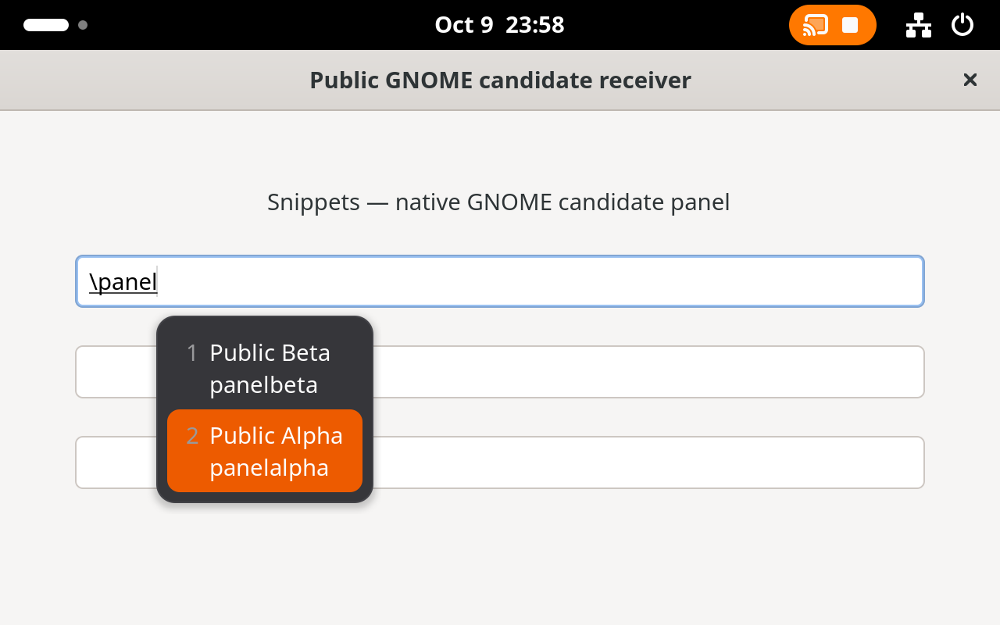
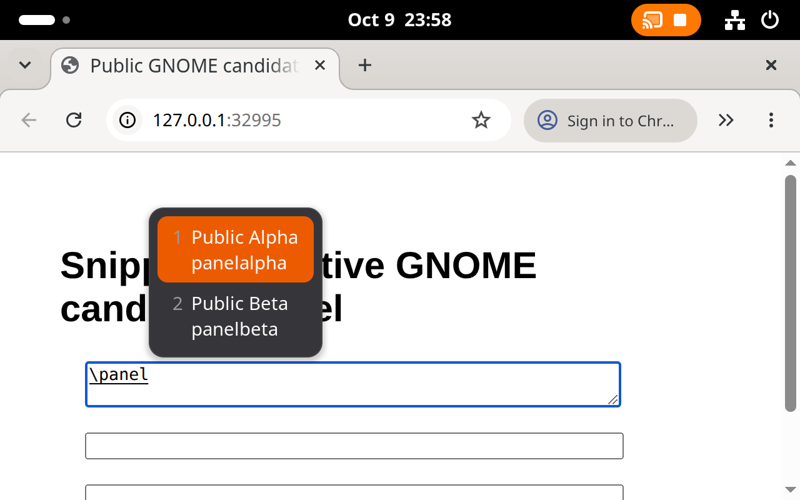

# GNOME desktop preview

## Scope

The first GNOME milestone targets stock Ubuntu GNOME on Wayland, preserving its
IBus input system. It shares the GTK application and library with the Hyprland
build. It does not replace input methods or enable Shell Eval. An experimental
Shell companion now supplies ordinary picker insertion. The installer stages
the components; Settings now offers explicit per-user preparation and activation.
Real systemd-managed session restart is now checked in a disposable headless
Ubuntu account; GDM authentication and a physical-seat login remain unqualified.

Implemented:

- A `desktop` build independent of the optional `fcitx` feature. Default Cargo
  builds retain `desktop,fcitx` for Hyprland.
- Desktop detection for colon-separated `XDG_CURRENT_DESKTOP` values, including
  `ubuntu:GNOME`. Ambiguous GNOME/Hyprland environments remain unavailable.
- Read-only session-lock observation through GNOME Shell's
  `org.gnome.ScreenSaver` interface, alongside the existing logind sleep monitor.
  Missing owners, malformed replies, closed connections and stale observations
  cannot authorize protected operations. Lock/unlock cycles revoke in-flight
  work even when both signals arrive between UI ticks.
- A GNOME install mode which neither requires nor installs the Fcitx addon.
- An explicit `unsupportedDesktop` expansion status in the desktop-only build.
- An experimental `ibus` feature with a separate native engine built against
  public libibus and xkbcommon APIs. It shares matching and bounded candidate
  metadata with Fcitx, but commits through an IBus input context. The Fcitx path
  still requires its original Hyprland window/process witness.

IBus expansion and caret suggestions have real GTK4 and native Wayland Chromium
coverage below; other application input paths remain unqualified.
An experimental GNOME GlobalShortcuts portal adapter registers Open, Picker and
Capture actions through the system permission dialog. Shortcut delivery and the
associated capture or insertion operation are verified separately.
An experimental Shell companion supplies cross-application ordinary insertion
for native Wayland text-input clients. GNOME clipboard-history capture remains
unimplemented. Existing Hyprland
window-target and Wayland peer checks remain required for those mechanisms.
The GNOME installer builds `desktop,ibus` and installs the engine and companion.
It does not enable them or replace existing input sources. The integration
remains experimental until the remaining acceptance cases are complete.

## Build and install

Requires Rust 1.92 or newer, GTK >= 4.12 and libadwaita >= 1.5. This was exercised
on Ubuntu 26.04.1 arm64 with GNOME Shell 50.1, GTK 4.22.4 and libadwaita 1.9.1.
Older distributions may need newer development packages; they are not qualified.

```sh
sudo apt install build-essential cargo pkg-config libgtk-4-dev libadwaita-1-dev \
  libicu-dev libsecret-1-dev libpam0g-dev libaudit-dev libcap-ng-dev \
  libqrencode-dev libwayland-dev wayland-protocols libxkbcommon-dev libjson-c-dev \
  libibus-1.0-dev python3
./scripts/install-linux.sh --desktop gnome
```

`--desktop auto` (the default) selects GNOME from `XDG_CURRENT_DESKTOP`, otherwise
it selects the existing Hyprland build. SSH or VM execution tools may omit the
desktop environment, so select `--desktop gnome` explicitly there. GNOME build
artifacts default to `snippets-linux/target/gnome`, separate from the Hyprland
artifacts. `CARGO_TARGET_DIR` can override either directory. Library storage is
preserved. Switching an existing prefix does not remove old Fcitx addon files or
change a running input-method service; use a separate prefix for this preview.

Installed GNOME files include `share/snippets-linux/snippets-ibus`,
`share/ibus/component/snippets.xml`, and
`share/gnome-shell/extensions/snippets@wowlocal.github.io/`. Component XML and all
desktop actions contain the actual absolute installation path. Reinstallation
preserves library data, opt-in preferences and desktop/input configuration.

Open **Settings → GNOME Integration → Prepare Integration** after installation.
This adds a managed per-user drop-in for
`org.freedesktop.IBus.session.GNOME.service` and stages the companion under the
user's GNOME extension directory. It preserves existing effective custom IBus
component paths and the compiled system component directory. It reloads the
user service configuration without restarting the running input daemon.
The managed drop-in refreshes IBus's registry cache with `ibus write-cache`
before subsequent daemon starts, using the effective component search path.
Without this, an existing registry cache can hide the newly installed engine
even after a new session. A cache-refresh failure does not prevent the ordinary
input daemon from starting; activation still requires actual engine discovery.
Unmodified v1 Snippets drop-ins are upgraded to v2 on preparation.
Unknown/edited managed service drop-ins, foreign or newer companion metadata,
custom service environment files, explicit removal of `IBUS_COMPONENT_PATH`,
and unapplied service changes are refused with a
message; existing files are preserved.

Sign out and back in, then choose **Enable Integration**. This explicitly enables
only the Snippets companion, appends the Snippets IBus input source if absent,
and selects it through GNOME's input-source manager. Existing layouts remain
available. Globally disabled user extensions are not silently re-enabled.
Expansion and suggestions remain separate opt-ins in **Input & Clipboard**.
The companion accepts input setup only from the primary application while its
window is focused. Owner/focus changes, lock, sleep and companion disable cancel
pending setup authorization. Repeating preparation or activation does not add
duplicate paths or sources. A failed activation is not presented as ready.

Stock IBus does not discover a user-prefix component XML without a search-path
configuration; its `IBUS_COMPONENT_PATH` replaces the default list. See the
[IBus registry implementation](https://github.com/ibus/ibus/blob/main/src/ibusregistry.c).
New GNOME Wayland extension code is loaded at the next login. See the
[GNOME extension guide](https://gjs.guide/extensions/development/creating.html).
Do not replace the running user's input daemon to reproduce an isolated test.
Moving the installation requires repeating preparation and signing in again.
To remove this integration, deselect/remove the Snippets source in GNOME Keyboard
settings, disable the Snippets extension, remove the managed
`~/.config/systemd/user/org.freedesktop.IBus.session.GNOME.service.d/90-snippets.conf`,
and sign out and back in (or restart). Other input sources and extension settings
must be retained. Respect `XDG_CONFIG_HOME` when it differs from the default.

Six preparation tests passed, covering idempotence, preserved custom component
paths, changed/foreign/linked files and exact path decoding by native systemd in
`--test` mode (no services started), plus exact v1 migration. The owned session runner
`docs/linux/testing/gnome_setup.py LAB PREFIX` exercises the actual installed
Settings window and real Shell/IBus input-source activation. Its private bus uses
a narrow systemd protocol fixture because the headless session has no user
service manager. The installed Release passed this UI flow with US/RU sources
preserved, followed by the real GTK picker privacy/cancellation regression; this
is not a qualification of a complete systemd-managed login.

The separate `docs/linux/testing/gnome_login_setup.py` regression passed using a
real systemd user manager and `gnome-session --session=ubuntu` under a disposable
account. Only that account's Shell launch was changed to a virtual headless
monitor; the stock IBus service and GNOME targets were retained. The initial v1
run reproduced missing engine discovery after session restart despite the
correct daemon environment. The fixed installed Release upgraded the drop-in
through Settings, preserved the running IBus PID during preparation, and passed
discovery and Settings activation after restarting the owned session. Actual
daemon environment, new Shell/IBus PIDs, selected engine and preserved US/RU
sources were asserted. This covers stale-cache startup and setup migration;
it does not cover GDM authentication, suspend or authenticated unlock.

The real Ubuntu Release artifacts passed the isolated installer check below.
The equivalent Hyprland Release check passed on Omarchy with `--desktop hyprland`:

```sh
python3 scripts/test-linux-install.py --target-dir snippets-linux/target/gnome
```

This verifies binary contents and single-link installation, repeat installation,
real IBus XML parsing, and real GLib desktop/action launch with a fictional
executable at a path containing spaces, quotes and other special characters.
The check uses disposable prefixes and never launches the installed GUI or
opens a user library. It requires Python GI, the IBus typelib and
`desktop-file-validate` from `desktop-file-utils`.

## Verification

Run the feature matrix on Linux:

```sh
cargo test --locked --manifest-path snippets-linux/Cargo.toml
cargo test --locked --manifest-path snippets-linux/Cargo.toml --no-default-features --features desktop
cargo check --locked --manifest-path snippets-linux/Cargo.toml --no-default-features
```

The GNOME module tests use a real private `dbus-daemon` and a fictional Shell.
They cover locked/unlocked states, rapid cycles, foreign signals, loss of Shell,
separate ownership of the public ScreenSaver service and connection closure.
They never lock or unlock the actual desktop.

For a running GNOME session with **no existing Snippets primary process**:

```sh
SNIPPETS_GNOME_LIVE=read-only cargo test --locked \
  --manifest-path snippets-linux/Cargo.toml --no-default-features --features desktop \
  --test gnome-desktop -- --ignored --test-threads=1
```

Run from the desktop session so its D-Bus and Wayland environment is inherited.
The test reads the real screen-lock state, starts the actual GTK app in the
background with a temporary library, exercises CLI expansion controls, verifies
`unsupportedDesktop`, and checks that one Quit terminates the app. It leaves the
real library, input configuration, keyboard, pointer and clipboard untouched.
It passed on the Ubuntu VM with the screen locked on 2026-10-09. Interactive
editing, unlock/relock and IBus text insertion are separate, outstanding checks.

The Ubuntu desktop feature suite completed with **1090 passed, 89 ignored**;
the live GNOME test is a separate additional pass. The headless configuration
also passed `cargo check`. An isolated installer smoke check using staged debug
executables verified the links, desktop entry and absence of Fcitx files; this
was a file-layout check, not a qualified Release build.

The Hyprland/default-feature library run passed 1057 tests, failed 10 and
ignored 87 under parallel VM load. All 10 failures passed when rerun sequentially
without changing application code or timeouts; the same rerun also passed all
six desktop adapter tests. This is not a clean full parallel run. Prefer bounded
test concurrency for the expensive restoration fixtures on this VM. Strict
`cargo clippy --all-targets -- -D warnings` passed for the default build.

## Next implementation boundary

The IBus prototype owns composition generations across reset, focus and content
type changes; drops pending work on connection loss or consent revocation; and
checks GNOME Shell's unlocked state through its unique bus owner before delivering
a reply. Candidate rows contain ordinary-snippet metadata, never vault bodies.
Its popup currently uses GNOME's native IBus candidate presentation.

The owned GTK4/Wayland receiver passed exact expansion, password pass-through,
cross-field cancellation and screen-shield activation/deactivation. The last case
uses a headless Shell with authentication locking disabled; it is not a test of
an authenticated unlock or logind session suspension.

Chromium 155.0.8059.39 passed exact expansion, password pass-through and cross-field
cancellation with composition finished, using native Wayland text-input-v3 and a
fresh profile. The Ubuntu snap's binary was launched directly with the guest's
system libraries; this does not qualify the confined snap launcher or default
browser flags. The runner explicitly enables Wayland IME and text-input-v3.

The earlier first-key failure came from the test keyboard: Mutter creates its
virtual keyboard lazily, and hot-plugging it during the first composition caused
Chromium to reset that composition. The runner now primes the keyboard before
starting Chromium and retains it throughout the run. No product-code focus/reset
checks were relaxed. The alternate GTK IME browser path remains unqualified.
The installed Release engine was launched automatically by IBus from the
generated component XML and passed the GTK4 and Chromium native Wayland checks.
It additionally passed real GTK4 input-source switch
and IBus-daemon restart checks: old preedit was cancelled, suffix-only typing
stayed literal, and a fresh query expanded after reconnection. The owned
supervisor stops and recreates only its private daemon; this is not a test of
the user's systemd service or login flow. The separate Settings/systemd setup
check is described above. Ordinary picker insertion has the separate coverage
below.

**Native candidate panel:** `gnome_popup.py` passed with the installed Release
on GNOME 50.1 and Chromium 155.0.8059.39. It checks actual visible Shell candidate
rows through AT-SPI, rather than just an IBus lookup-table signal. GTK coverage
includes Down/Enter and Tab selecting the expected body, Escape preserving the
literal query, and panel cancellation on field change and disabled expansion.
Both GTK and Chromium password fields remain literal with no candidate panel.
Chromium additionally asserts the exact resulting DOM value and finished
composition after selection, Escape and cross-field cancellation. It uses the
same explicit native Wayland flags and direct-binary limitation described above.

Screenshots are acquired through the public Screenshot portal after approving
the owned lab's permission dialog with its virtual keyboard. No Shell Eval,
service impersonation, screenshot API bypass or pointer movement is used. Visual
inspection confirmed legible name/keyword rows, the selected-row highlight and
caret placement (including placement above the caret near the screen edge).
The styling follows the GNOME Shell theme, independently of Hyprland's panel.





The shortcut adapter owns a private portal connection and session. It registers
the native desktop application identity before other portal calls, checks sender
and session identity, bounds and expires queued activations, and discards sessions
when their portal owner disappears. Permission revocation and existing lock-epoch
checks still apply in the common worker. Wayland activation tokens are passed only
to the window opening for that event. The adapter supports portal version 1; on
version 2 it additionally exposes Change Keys through ConfigureShortcuts. On
version 1, bindings are edited in the application's page in GNOME Settings.

The real portal fixture passed all three action bindings, clean disconnect and
reconnect, explicit session closure, and opening/activating the actual GTK main
window and picker. The targeted shortcut suite passed 14 tests (two separate
native fixtures ignored by default) on both Ubuntu and Omarchy. Strict all-target
Clippy passed for `desktop,ibus` on Ubuntu and the default Fcitx build on Omarchy.

**Frontend restart recovery:** the original failure was reproduced again on the
Ubuntu image: the GNOME backend retained an orphan session and its accelerator
grabs after the frontend vanished. A new frontend accepted registration but
delivered no keys. The adapter now releases its exact old session through
`org.freedesktop.impl.portal.Session.Close`, only after the frontend's unique bus
name has actually disappeared. The call is pinned to the GNOME backend owner
observed when that session was created. It neither enumerates other sessions nor
creates registrations through the implementation API. A living frontend remains
the authority for Close. This GNOME-specific cleanup uses the backend's
[session-close implementation](https://github.com/GNOME/xdg-desktop-portal-gnome/blob/main/src/session.c)
and [accelerator cleanup](https://github.com/GNOME/xdg-desktop-portal-gnome/blob/main/src/globalshortcuts.c).

The worker revokes previously delivered/queued events before reconnecting through
the normal permission portal. It recovers only from confirmed frontend owner
loss; explicit Session.Closed, denied registration, disabled consent and a
stopped worker do not retry automatically. A private D-Bus test verifies that
cleanup never redirects to a replacement backend or another session, and worker
tests verify event revocation through recovery and stop.

The owned `--restart-portal` fixture now passes actual post-crash key delivery.
The installed Release app also stayed running, reconnected without a Retry click,
and opened its previously minimized window on a fresh key press. Services on the
user's desktop were untouched. This covers a frontend crash on the qualified
Ubuntu image; complete login/onboarding and other portal implementations remain
separate acceptance cases.

See the public [GlobalShortcuts interface](https://github.com/flatpak/xdg-desktop-portal/blob/main/data/org.freedesktop.portal.GlobalShortcuts.xml)
and [native application registry](https://github.com/flatpak/xdg-desktop-portal/blob/main/data/org.freedesktop.host.portal.Registry.xml).
The event age check is GNOME-specific: its backend forwards Mutter's wrapping
32-bit monotonic millisecond timestamp; it is not assumed to be a portable clock
for other portal backends. See the [GNOME implementation](https://gitlab.gnome.org/GNOME/xdg-desktop-portal-gnome/-/blob/main/src/globalshortcuts.c).

## Ordinary picker insertion companion

`snippets-linux/gnome/snippets@wowlocal.github.io` is currently qualified against
GNOME Shell 50. The app pins its companion calls to the issuing Shell's unique
D-Bus owner. The companion admits only the connection owning the primary
`com.khm.snippets.linux` application name; it has no arbitrary window selector,
or generic key-injection method. A separate, bounded text reader supports
explicit clipboard Capture and the inline `{clipboard}` placeholder.

Capture produces a random, memory-only ticket for the active foreign window and
current Mutter input focus. It binds the ticket to the calling application owner
and process, expires after 120 seconds, and permits one ordinary insertion. The
app restores the original window before committing through Mutter's input-method
transport. Password/unknown purposes and private/hidden/unknown hints are refused
again at delivery. Returning to a target manually, selecting another window,
physical input outside the picker, entering overview, a screen-shield transition,
sleep notification, owner loss, or companion disable revokes the pending ticket.
A fresh ticket is required after re-enable. Secure insertion does not use this
ordinary text endpoint.

Successful GNOME insertion does not write the clipboard. The app reads clipboard
text only for an explicit `{clipboard}` placeholder on this path. An unavailable
or changed target reports that the picker must be reopened from the target window;
it does not claim a successful paste or silently redirect to the newly focused
application. The existing Hyprland clipboard/paste path is retained.

The owned real GTK4 and Chromium receivers passed ordinary insertion (including
multiline Unicode in Chromium), refusal of
password targets and cancellation after an intervening window switch. GTK also
verified unchanged clipboard contents, foreign D-Bus caller refusal, companion
disable/re-enable and a headless screen-shield cycle. This shield has no password;
it does not qualify authenticated unlock or a real logind suspension. The policy
fixture additionally covers sleep notifications, owner replacement, expired and
single-use tickets, pending capture races, privacy hints and payload limits.

The destination contract is a window plus the currently declared native input
focus, not a browser DOM element identifier. Application-internal background
changes are not observable as stable field identities through Mutter. Clients
using a direct IBus module or X11 without a Mutter text-input focus are refused
and retain the explicit Copy workflow; those paths are not qualified for picker
insertion. The Chromium run uses native Wayland IME/text-input-v3 flags. Installation,
input-source onboarding and broader application coverage remain incomplete.

The companion policy fixture, formatting and syntax checks passed. Both the
Ubuntu `desktop,ibus` build and the default Omarchy build passed Clippy with
warnings denied and all six filtered desktop tests. This regression run does not
claim a new Hyprland UI qualification.

The experimental feature's build, four Rust bridge tests, 27 filtered worker
tests, native IBus protocol smoke and GTK4 receiver passed in the Ubuntu VM.
The protocol smoke includes application stop/restart and reconnect. The shared
refactor also passed strict all-target Clippy and five bridge tests on Omarchy,
including the native Fcitx state fixture. These targeted checks do not replace
the remaining GNOME acceptance cases.

Privacy detection depends on the application's input-purpose/hint declarations.
GTK's visual `visibility=false` alone does **not** declare a password field; GTK
documents that applications must also set password/PIN input-purpose. IBus cannot
distinguish such an undeclared masked widget from an ordinary field. Password,
PIN, PRIVATE, HIDDEN_TEXT and unknown hint bits are rejected when reported.
See [GtkText visibility](https://docs.gtk.org/gtk4/method.Text.set_visibility.html).

For reproducible, isolated engineering runs, see
[the GNOME test harness](testing/README.md#owned-gnome-session).

Reference: GNOME Shell implements the read-only ScreenSaver interface at
`/org/gnome/ScreenSaver` on its own bus connection. Modern GNOME can also expose
the public `org.gnome.ScreenSaver` bus name through a separate forwarding process.
The adapter therefore resolves `org.gnome.Shell`, calls its unique owner, checks
ownership again after the reply and accepts signals only from that owner.
See the [upstream implementation](https://github.com/GNOME/gnome-shell/blob/main/js/ui/shellDBus.js)
and [interface definition](https://github.com/GNOME/gnome-shell/blob/main/data/dbus-interfaces/org.gnome.ScreenSaver.xml).


## Explicit clipboard Capture and inline placeholders

The GNOME adapter reads text through Mutter's public selection API, using
`Meta.SelectionType.SELECTION_CLIPBOARD`. It never falls back to primary selection
or reads an unknown selection type. Only the primary application's connection is
admitted, and the Rust caller checks the Shell's unique owner before and after
reading. A normal declared text focus is required. Password/private/unknown
contexts and advertised sensitive, internal or file-selection MIME hints are
refused before requesting bytes.

Transfers are limited to 256 KiB plus one overflow-detection byte, one pending
request, and 1.5 seconds in Shell (with a separate caller deadline). Invalid UTF-8,
NUL, overflow and failed/cancelled transfers cannot become partial success.
Selection replacement, window focus change, shield/sleep signals, owner loss and
companion disable cancel pending reads. No clipboard content is cached, logged,
written to disk by the reader, or written back to the clipboard. Explicit Capture
creates an ordinary draft using the existing editor; `{clipboard}` supplies only
the current explicitly requested expansion. Empty text is valid for a placeholder
but cannot create an empty Capture draft. Portal window activation happens after
acquisition so the app does not move focus during its own read.

The installed Release passed actual GTK global Capture with exact multiline
Unicode, sensitive-hint/password/oversize/empty refusal and unchanged clipboard,
and GTK IBus expansion of `Before {clipboard} After`. Chromium passed physical
Copy followed by the real Capture shortcut, producing an exact multiline Unicode
draft; its native Wayland/snap-launcher limits remain as described above.
A separate real Mutter
protocol client with a native delayed GTK content provider passed cancellation
on clipboard replacement, shield transition and companion disable. It claims
only an unused primary name on the private lab bus; it does not substitute for
the actual application UI check. No Shell Eval or user pointer is used.

```sh
python3 docs/linux/testing/gnome_clipboard_protocol.py LAB
python3 docs/linux/testing/gnome_picker.py LAB PREFIX/share/snippets-linux --clipboard --chromium /path/to/chromium
python3 docs/linux/testing/ibus_engine_smoke.py LAB PREFIX/share/snippets-linux --installed --gtk --clipboard
```

These explicit reads do not enable background history. GNOME background clipboard
history remains unimplemented. MIME privacy markers depend on what the producing
application advertises; unmarked secret text cannot be identified reliably.
The native-focus contract and browser qualification limits above still apply.
